## 计算机毕业设计Python+Spark知识图谱课程推荐系统 课程用户画像系统 课程大数据 课程爬虫 课程大屏 mooc慕课推荐系统 大数据毕业设计

## 要求
### 源码有偿！一套(论文 PPT 源码+sql脚本+教程)

### 
### 加好友前帮忙start一下，并备注github有偿Spark课程推荐
### 我的QQ号是2827724252或者798059319或者 1679232425或者微信:bysj2023nb

# 

### 加qq好友说明（被部分 网友整得心力交瘁）：
    1.加好友务必按照格式备注
    2.避免浪费各自的时间！
    3.当“客服”不容易，repo 主是体面人，不爆粗，性格好，文明人。

## 介绍
算法装杯显摆炫耀如下：神经网络混合CF推荐算法 MLP深度学习算法 SVD深度学习算法 协同过滤推荐算法 线性回归预测 KNN CNN卷积神经 lstm情感分析
创新点10+个足够暴打锤击导师，无底线碾压秒杀、摩擦答辩现场，最低答辩99分-100分：知识图谱、预测算法、4种推荐算法(机器学习、深度学习)、Python爬虫、大屏可视化、短信、支付、识别、lstm情感分析、知识图谱
开发技术：spark hadoop springboot vue.js mysql echarts python

## 演示视频
https://www.bilibili.com/video/BV1EcxxebEqy

## 截图

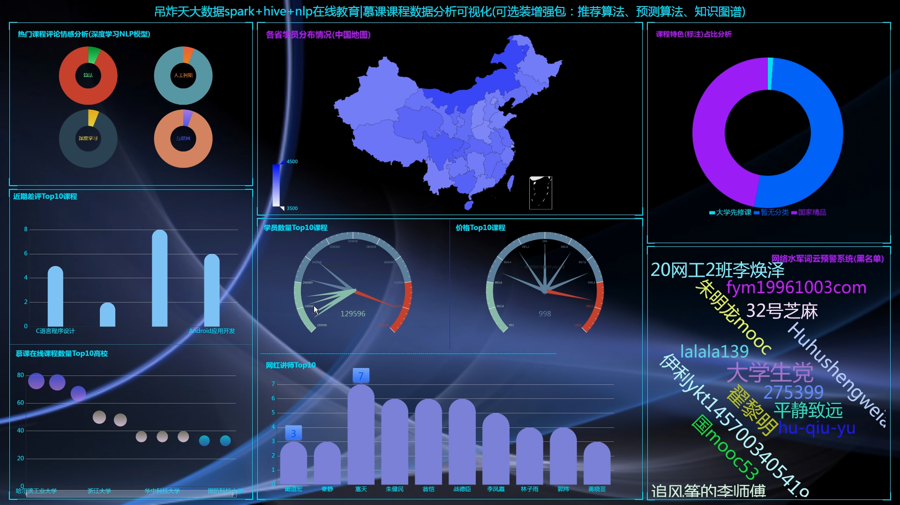
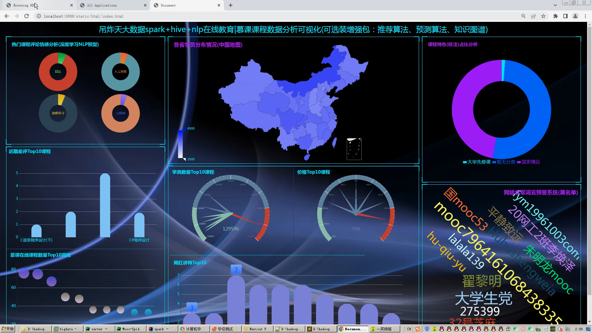
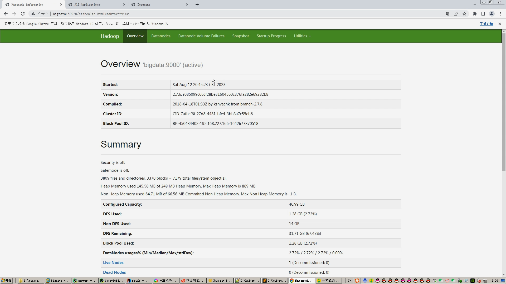
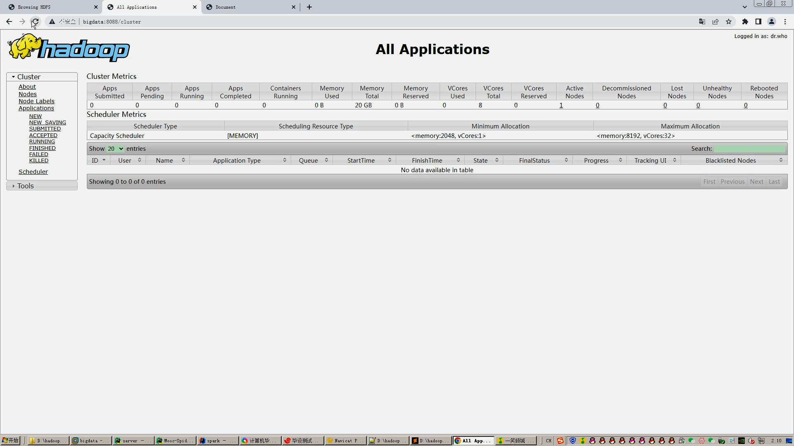
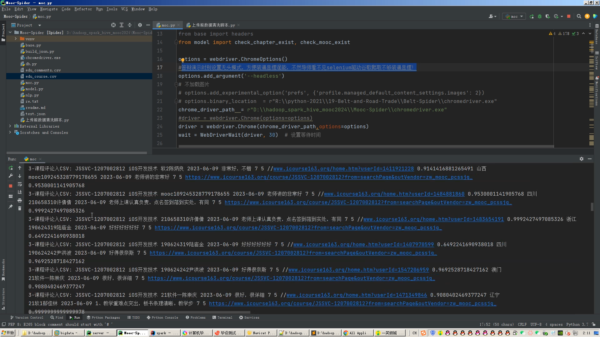
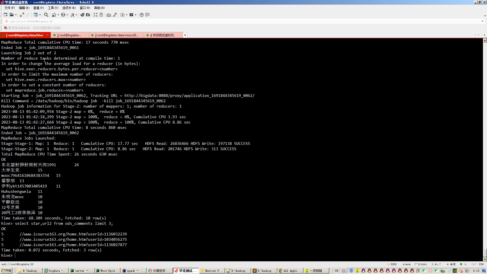
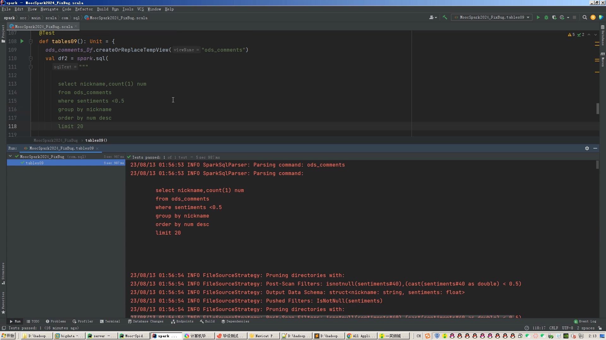
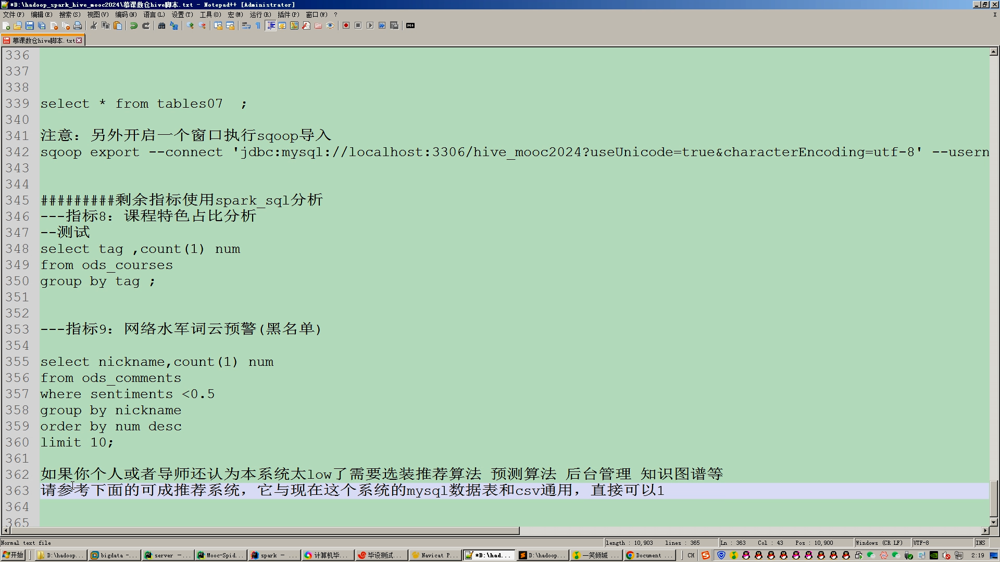
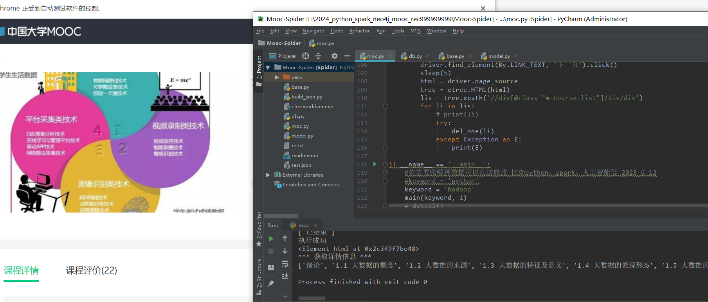
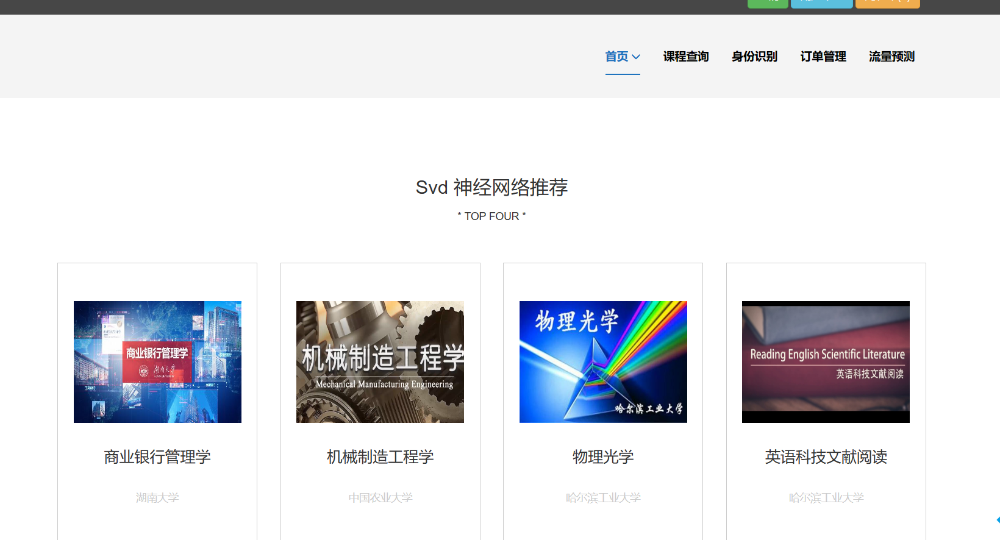
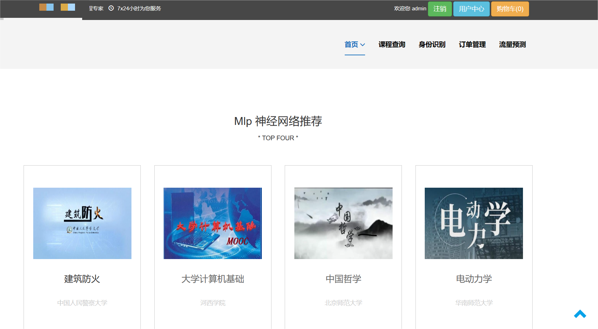
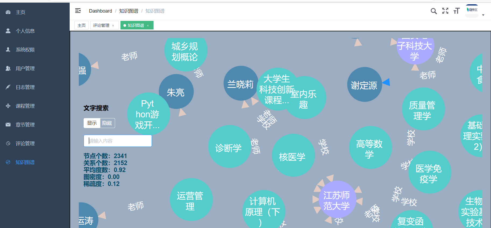
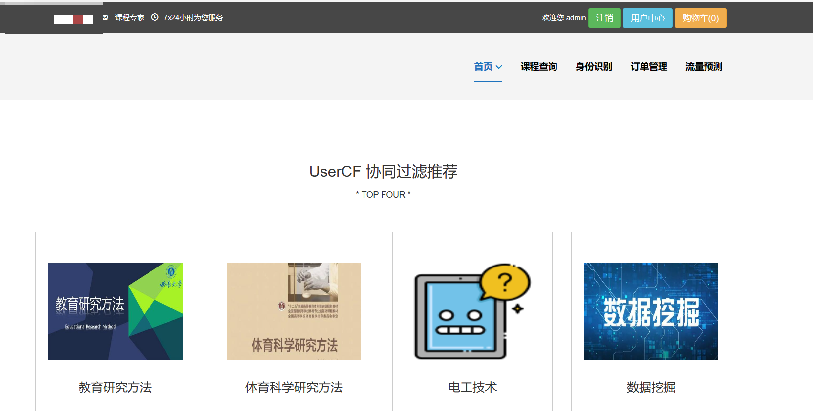
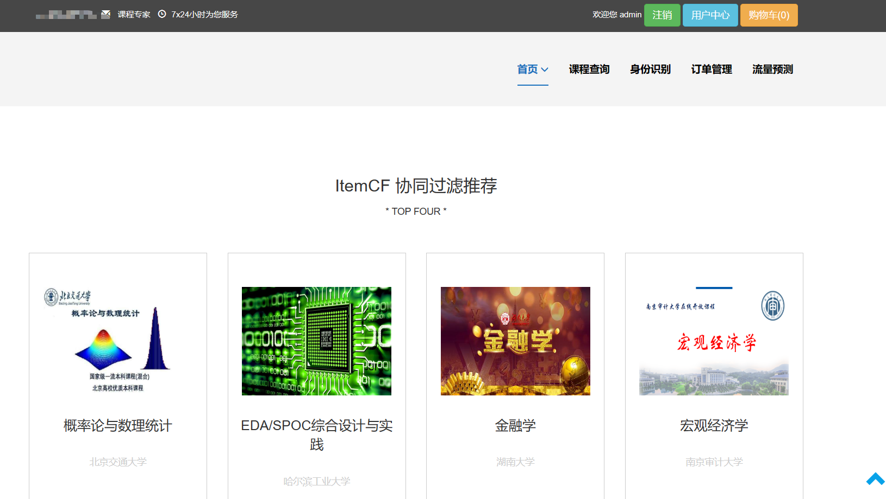
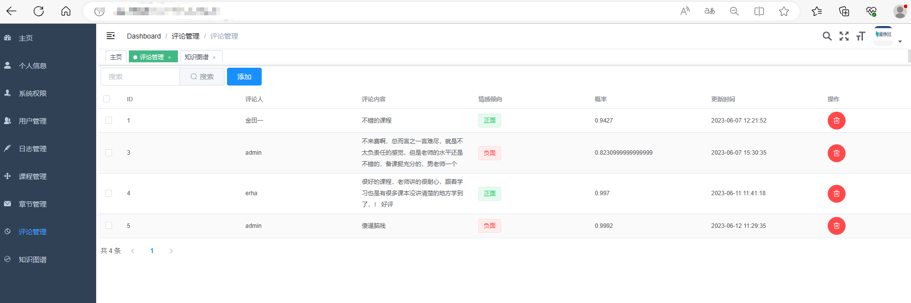

